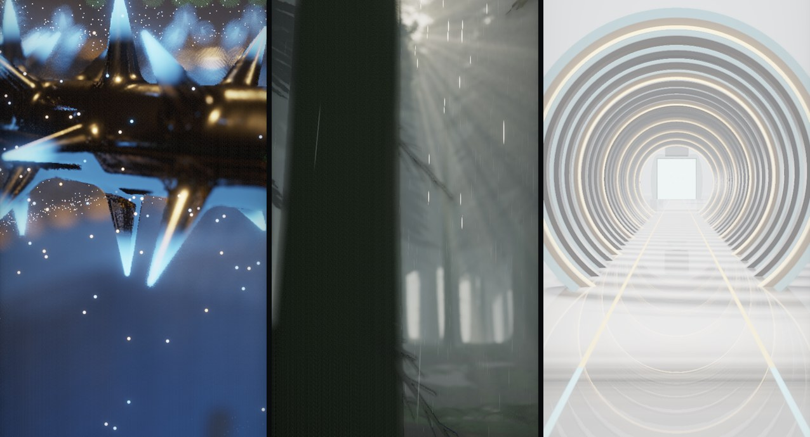
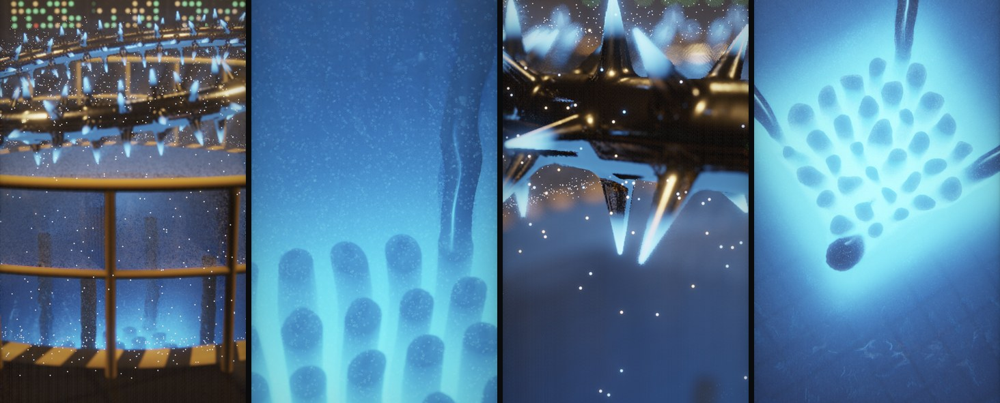
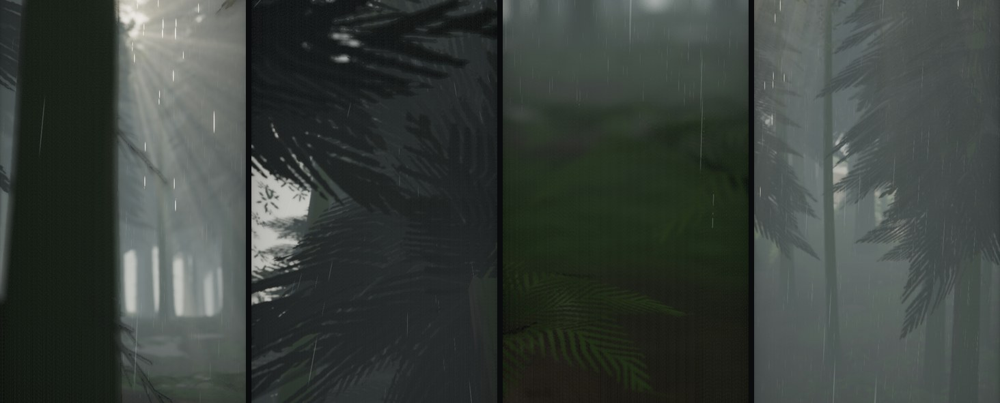
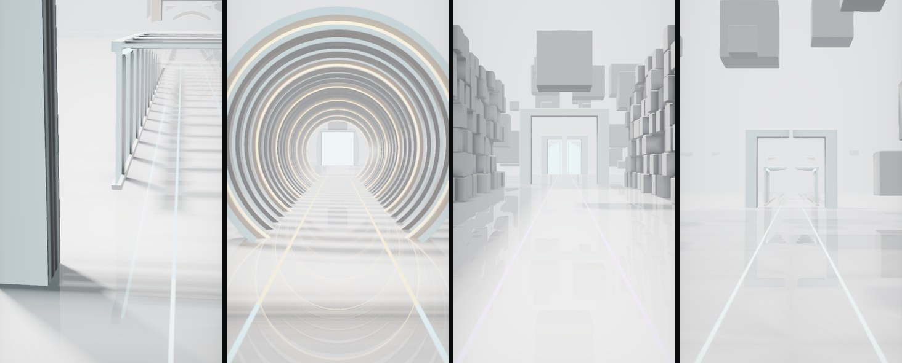
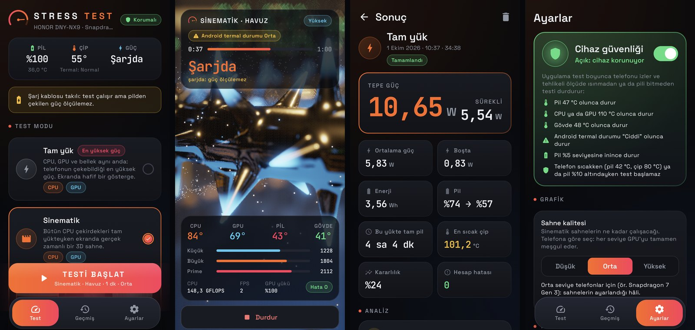

<div align="center">

# Stress Test

**Android telefonlar için stres testi ve benchmark: bir telefonun gerçekten çekebildiği en yüksek gücü bulmak, bunu yaparken de göze iyi görünmek için.**

[](https://kotlinlang.org)
[](https://developer.android.com/compose)
[](app/src/main/cpp)
[](app/src/main/cpp/cpu)
[](app/src/main/cpp/gpu)
[](app/build.gradle.kts)
[](#ayarlandığı-cihaz)
[](#durum)

Ayarlandığı telefonda tam yükte **10,1 W** · aynı çekirdeklerde "kuru %100"ün **2,6 katı** güç · üç kalitede üç sinematik sahne · cihaz güvenliği · PDF rapor

[Soru](#soru) · [Sonuçlar](#sonuçlar) · [Modlar](#modlar) · [Sahneler](#sinematik-sahneler) · [Uygulama](#uygulama) · [Cihaz güvenliği](#cihaz-güvenliği) · [Güç nasıl ölçülüyor](#güç-nasıl-ölçülüyor) · [Yük nasıl üretiliyor](#yük-nasıl-üretiliyor) · [Mimari](#mimari) · [Derleme](#derleme)

*[English](README.md)*

<br />



</div>

---

Tek bir telefonla başlamış kişisel bir proje. 0.1.0 yalnız bir **Honor 400**'ü
hedefliyordu; 0.2.0'dan beri (2 Ekim 2026) Android 10 ve üstü her 64-bit telefonda
çalışıyor. Aşağıdaki her sayı Honor'da ölçüldü; her yük de genel bir telefona göre
değil, bu ölçümlere göre seçildi. Seçimler taşınıyor: bir çekirdeğin çarp-topla
birimlerini, yükleme yolunu ve önbelleklerini aynı anda meşgul eden yük, bir
sonraki çekirdek tasarımında da en çok gücü çeker. Bu yüzden tarifler aynen kaldı;
uygulama da öbür telefonlarda yolunu bulmayı öğrendi: çekirdek sayıları ve adları,
sıcaklık sensörleri, GPU sürücüleri.

## Soru

Telefondaki stres testlerinin çoğu aynı şeyi gösterir: bütün çekirdekler %100.
Bu sayı bir çekirdeğin ne kadar meşgul olduğunu söyler, ne kadar çalıştığını
değil. Bir çekirdek birbirine bağlı tamsayı toplamalarıyla tamamen doldurulabilir
ve birimlerinin neredeyse hepsi boşta kalır. Aynı çekirdek, işlenenleri
önbellekten akan vektör çarp-topla komutlarıyla da doldurulabilir: aritmetik
birimler, yükleme yolu ve önbellek aynı anda çalışır. İkisi de %100 görünür.
Telefonu ısıtan yalnız biridir.

Bu, Cinebench ile Prime95 arasındaki farktır ve bu proje onu ölçer. Bu telefonda:

| Sekiz çekirdekte çalışan | Görünen yük | Pilden çekilen güç |
| --- | --- | --- |
| Birbirine bağlı tamsayı toplamaları (`dry`, "kuru %100") | %100 | **2,46 W** |
| FP32 çarp-topla, işlenenler L2'den akar (`fp32_l2`) | %100 | **6,39 W** |
| Aynısı, artı GPU'nun FP32 yakıcısı (**Tam yük**) | %100 + GPU %100 | **10,1 W** ¹ |

<sub>İlk iki satır aynı oturumdan, oda sıcaklığında: aynı %100, 2,6 kat güç.
¹ Daha sonraki bir oturumda, telefon metal bir yüzeyde ve vantilatörün önündeyken ölçüldü;
soğutma sürdürülebilen gücü artırır. O oturumda `fp32_l2` tek başına 7,10 W çekti.</sub>

Bu yüzden buradaki tek ölçüt **pilden çekilen güç, watt cinsinden**. Bir yük
ancak ölçülen hiçbir şey ondan fazla çekmiyorsa "en yüksek"tir. Telefonun kendi
denetleyicileri ne yaparsa onu yapar, sonuç ekranı ne zaman ve ne kadar
yaptıklarını gösterir. 0.2.0'dan beri uygulama telefonu varsayılan olarak da
korur ([cihaz güvenliği](#cihaz-güvenliği)): pil, gövde ya da çip tehlikeli ölçüde
ısınmadan testi durdurur. Kapatılınca tamamen kenara çekilir.

Aynı ders sonradan GPU'da da çıktı. Işın yürüten bir sahne GPU'yu %100 meşgul
eder ama 2,95 W çeker; aynı GPU'da FP32 çarp-topla yakıcısı 5,45 W çeker.
Meşgul olmak orada da çalışmak demek değil.

## Sonuçlar

Bütün değerler Android'in `BatteryManager`'ından okunan pil gücüdür; telefon
kabloya bağlı değilken, kendi kendine koşturduğu oturumlarda ölçüldü (bkz.
[Güç nasıl ölçülüyor](#güç-nasıl-ölçülüyor)). Her oturumun koşullarıyla birlikte
tam kayıt [docs/OLCUMLER.md](docs/OLCUMLER.md)'de.

**CPU çekirdek yükleri, sekiz çekirdekte, ilk 30 sn ortalaması, her biri rastgele sırayla iki kez, oda sıcaklığında:**

| Yük | Neyi çalıştırır | Güç |
| --- | --- | --- |
| `fp32_l2` | FP32 FMA, işlenenler 256 KiB'lık tampondan akar | **6,39 W** |
| `i8_mmla` | INT8 matris çarp-topla (SMMLA) | 5,27 W |
| `fp64_gemm` | FP64 FMA, L1'den 8×6 dış çarpım | 5,08 W |
| `mixed` | FMA, tamsayı zinciri, çarpıcı ve yazma aynı anda | 4,95 W |
| `bf16_mmla` | BF16 matris çarp-topla (BFMMLA) | 4,80 W |
| `fp32_dram` | FP32 FMA, işlenenler 32 MiB'tan akar | 4,76 W |
| `fp32_gemm` | FP32 FMA, L1'den 8×12 dış çarpım | 4,54 W |
| `memcopy` | 32 MiB kopyalama: saf bellek bant genişliği | 4,13 W |
| `i8_dot` | INT8 nokta çarpımı (SDOT) | 3,95 W |
| `fp32_reg` | Yalnız yazmaçta FP32 FMA | 3,93 W |
| `dry` | Birbirine bağlı tamsayı toplamaları | **2,46 W** |

İki şey öne çıkıyor. Gücü çeken yalnız aritmetik değil: yalnız yazmaçta çalışan
FMA, FMA birimlerini doldurduğu hâlde 3,93 W'ta kalıyor. Gücü getiren, verinin
taşınması. Tamponun da bir tatlı noktası var: aynı yük 128 KiB'ta 6,62 W,
**256 KiB'ta 7,10 W**, 512 KiB'ta 6,82 W çekiyor; 1 ve 2 MiB'ta ise 4,8 W'a
düşüyor, çünkü çekirdekler çoğunlukla belleği bekliyor. (Bu ikinci sayı dizisi
telefonun metal yüzeyde ve vantilatör önünde olduğu oturumdan; bir oturumun
içinde önemli olan sıralamadır.)

**GPU yakıcıları, tek başına:** FP32 ALU 5,57 W · FP16 ALU 3,70 W · harmanlama
3,09 W · doku örnekleme 3,03 W · bellek bant genişliği 2,73 W.

**Birlikte:** CPU'da `fp32_l2`, GPU'da FP32 yakıcısı ölçülenlerin en yükseği: iki
oturumda **10,09 W ve 10,13 W**. CPU ortak güç bütçesine biraz frekans bırakıyor
(A510 / A715 / prime yaklaşık 1,1 / 1,8 / 2,1 GHz'e oturuyor) ve toplam yine de
en yüksek kalıyor.

## Modlar

| Mod | Yük | Ekranda | Ölçülen |
| --- | --- | --- | --- |
| **Tam yük** | `fp32_l2` + GPU FP32 yakıcısı | yük kadranı (GPU yakıcıda) | **10,1 W** |
| **Sinematik** | `fp32_l2` + bir sahne | ana ekranda seçilen üç sahneden biri | havuzla 8,9 W |
| **CPU** | sekiz çekirdekte `fp32_l2` | kadran | 7,1 W (soğutmasız 6,4 W) |
| **GPU** | GPU FP32 yakıcısı | yük kadranı | 5,5 W |
| **Kuru %100** | `dry` | kadran | 2,5 W (soğutmasız) |

<sub>"Soğutmasız" yazmayanlar telefon metal yüzeyde ve vantilatör önündeyken ölçüldü.</sub>

Bir koşu 1, 5, 15 ya da 30 dakika sürer, ya da durdurulana kadar. Önce 10 saniye
dinlenir ve telefonun hiçbir şey yapmazken çektiği gücü ölçer; ardından ekranı
her seferinde aynı biçimde, tam parlaklık ve en yüksek yenileme hızında sürer ki
koşular karşılaştırılabilsin.

Sahnelerin Tam yükün arka planı değil ayrı bir mod olması ölçümle verilmiş bir
karar: sahne ekrandayken yakıcıya kare süresi kalmıyor ve tam yük 8,97 W'a,
yani en yüksek değerin %88,5'ine iniyor. Ölçümden önce yazılan kural %97 idi; bu
yüzden sahneler kendi modlarına taşındı ([docs/PLAN.md](docs/PLAN.md), §13/7).

## Sinematik sahneler

Projenin yarısında eklenen ikinci hedef: *bu telefonun gösterebileceği en
etkileyici görüntü.* Orta kalitede her sahne ekran çözünürlüğünün %45'inde çizilir ve zamanla
tam çözünürlüğe kurulur: her kare örneklerini piksel altı bir kaymayla oynatır
ve rastgele etkilerini yeniden tohumlar; zamansal geçiş önceki kareleri kamerayla
yeniden hizalar ve yeni kareye göre kırpar; Catmull-Rom süzgeci sonucu ekrana
büyütür. Telefonun GPU'sunda yaklaşık 1 TFLOPS aritmetik ama yalnız yaklaşık
16 GB/s bellek bant genişliği var; bu yüzden her etki belleğe değil aritmetiğe
mal olacak biçimde seçildi.

### Havuz



Havuz güvertesinden görülen bir araştırma reaktörü. Tek bir tam ekran ışın
yürütme gölgelendiricisi salonu, dikenli muhafaza halkasını ve suyun altında
Çerenkov mavisiyle parlayan yakıt demetini çizer. Su yüzeyi, GPU'da saniyede 60
kez dalga denklemiyle çözülen 256 × 256'lık bir yükseklik alanı: çekirdeğin
üstünde patlayan kabarcıklar halka dalgalar başlatır, dalgalar kesişir, havuz
duvarından yansır, kontrol çubuğu tüplerinin çevresinde saçılır; yüzey ışığı
kırıp tabana kostik desenler düşürür. 16.384 GPU parçacığı (yükselen kabarcıklar,
halkanın çevresinde dönen kıvılcımlar), bloom, çekime göre alan derinliği ve bir
darbe: her döngüde bir kez reaktör bir TRIGA gibi parlar. **Kare ~48 ms, ~20 fps.**

### Orman



Yağmurdan sonra ılıman bir yağmur ormanı. Havuzun aksine bu sahne geometri:
düzensiz bir ızgarada en çok 676 ladin ve kayın, dalları ve iğne demetleri,
eğreltiler ve devrik kütükler. Hiçbiri bellekte durmaz. Bir köşe gölgelendiricisi
her köşeyi çizimin ve örneğin numarasından kurar (köşe çekme), bir parça
gölgelendiricisi de her kartı bir iğne demetinin ya da yaprak kümesinin taslağına
göre keser. Güneşin gölge haritası bir kez çizilir; bir ışık geçişi her pikselin
ışınını sisin içinde bu haritaya karşı yürütür ve ışık huzmelerini çizer. 8.192
yağmur çizgisi huzmelerin içinde parlar, birikintilerde halkalar yayılır.
**Kare ~31-39 ms, ~25-30 fps.**

### Beyaz



Dramdan çok netlik üzerine: sonsuz bir beyaz boşluk, her şeyi yansıtan cilalı
bir zemin ve kesintisiz uçan bir kamera; asılı küplerin boşluğundan, cam bir
koridordan, kaburgalı cam bir tünelden ve duvarları üst üste küplerle örülmüş bir
odadan geçer. Cam ince ve soluk yeşil-mavidir, eğik bakıldıkça koyulaşır; böylece
arkadaki devasa beyaz dünya hep görünür kalır. Alan derinliği, renk saçılması ve
gren yok, bloom neredeyse yok; büyütmenin üstüne hafif bir keskinleştirme var.
**Kare ~38 ms, ~27 fps.**

### Grafik kalitesi

Her telefon, GPU'sunu tamamen yükleyen ve yine de izlemeye değer bir şey çizen bir
seviye bulur. Orta, sahnelerin orta seviye bir telefon olan Honor 400'de
ayarlandığı hâli; Yüksek en yeni amiral gemileri için ve orta seviye bir telefonu
saniyede birkaç kareye düşürür; Düşük giriş seviyesi telefonlar için.

| Seviye | Çözünürlük | Örnekleme | Honor 400'de karenin GPU süresi |
| --- | --- | --- | --- |
| **Düşük** | %30 | gölge dokunuşu ve huzme örneği yarıya | havuz 20,8 ms · beyaz 19,7 ms · orman 25,1 ms |
| **Orta** | %45 | ayarlandığı gibi | havuz 39,6 ms · beyaz 38,0 ms · orman 39,2 ms |
| **Yüksek** | %65 (orman: %100) | pikselde iki ışın; orman: 16 gölge dokunuşu, 24 huzme örneği, 4096² gölge haritası | havuz 295 ms · beyaz 200 ms · orman 147 ms |

<sub>Yalnız sahne, CPU boşta, GPU zaman damgaları. Örnek sayıları Vulkan specialization constant'ı; Orta, öncekiyle aynı işe derlenir.</sub>

## Uygulama



Test modları, sahne seçici ve kalitesi, pilin, çipin ve gücün canlı değerleriyle
bir ana ekran; sahneyi ya da kadranı ortada, sayıları kenarlarda tutan bir koşu
ekranı; bir sonuç ekranı; geçmiş; ayarlar. Bir koşunun sonucu tepe ve sürekli
gücü, ortalamayı, boştaki gücü, harcanan enerjiyi, pilin başını ve sonunu, bu
yükte tam bir pilin ne kadar dayanacağını, en sıcak çipi, CPU ve GPU iş hızlarını,
sahnenin kare hızını, kararlılığı ve hesap hatalarını gösterir; ardından düz
sözcüklerle bir **analiz** (telefon ilk ne zaman kısıldı, ilk dakikayla son dakika
arasında ne kadar hız verdi, çip ve pil ne kadar ısındı, pil ne hızla tükendi) ve
parmağın altında değerlerini okuyan güç, sıcaklık, frekans, iş ve kare hızı
grafikleri gelir. Herhangi iki koşu yan yana **karşılaştırılabilir**; bir koşu
telefondan iki sayfalık bir **PDF rapor** ya da eğrileri **CSV** olarak çıkabilir.
Cihaz ekranı telefonun işlemcisini, çekirdeklerini ve GPU'sunu adlandırır ve
uygulamanın onda neleri okuyabildiğini gösterir. Metinler İngilizce ve Türkçe:
uygulama, ayarlardan bir dil seçilmedikçe telefonun dilini izler (Android 13'ten
itibaren telefonun kendi uygulama dili ayarından da seçilebilir).

Yukarıdaki ekran görüntüleri şarj kablosu takılıyken alındı; güç alanlarının
*şarjda* yazması bu yüzden. Şarj olurken pilin akımı telefonun ne çektiği
hakkında bir şey söylemez ve uygulama onu göstermeyi reddeder.

## Cihaz güvenliği

Varsayılan olarak açık ve ayarlar ekranındaki ilk şey. Test sürerken uygulama
telefonu izler; bir değer üç saniye boyunca sınırının ötesinde kalırsa testi
durdurur. Koşu, nedeni ve ölçülen değerle birlikte saklanır.

| Durdurur | Uyarır | Şunun üstündeyken başlamaz |
| --- | --- | --- |
| pil 47 °C | 44 °C | 42 °C |
| CPU ya da GPU 110 °C | 105 °C | 80 °C |
| gövde 48 °C | 45 °C | 42 °C |
| Android termal durumu *ciddi* | *orta* | *ciddi* |
| pil %5 (pildeyken) | %10 | %10 |

Çip sınırı bilerek kısma noktasının üstünde: Honor'un çekirdeği CPU ve GPU
bölgelerini 95 °C'de kısmaya başlıyor (daha sert sınırları 110-115 °C, kritik
125 °C); 95 °C'de durdurmak her tam yük testini saniyeler içinde keserdi. Orada
her zaman tutmuyor da: bir tam yük koşusunda 37. saniyede GPU'nun kısmasını
kaldırıp 107 °C'ye çıkmasına izin verdi ve ilk sınır olan 105 °C o koşuyu 43.
saniyede kesti. Durdurma artık telefonun kendi sert kademesinin başladığı 110 °C'de,
uyarı 105 °C'den itibaren: sınır, kendi koruması artık yetişemeyen bir telefon
için. Cihaz güvenliğini kapatmak önce sorar; kapalıyken uygulama hiç araya girmez
ve yalnız telefonun kendi koruması kalır. İlk gerçek durdurmada, şarjdaki bir
orman koşusu Android *ciddi* termal durum bildirince 2:36'da bitti; sahibinin bu
özellik yokken yaptığı 34 dakikalık tam yük koşusu pili 43 °C'den 55 °C'ye
çıkarmıştı.

Uygulama her açıldığında bir uyarı bunu açıkça söyler: test telefonu tam
kapasitede çalıştırır ve çok ısıtır, cihaz güvenliği koruma garanti edemez,
sorumluluk kullanıcınındır. Uyarı ancak onaylanınca kapanır; "Bir daha gösterme"
onu kapatır, ayarlar yeniden açar.

## Güç nasıl ölçülüyor

Telefon, bir uygulamaya pilinin sysfs dosyalarını açmıyor; tek kaynak
`BatteryManager`. Bu telefondaki alanlarına güvenmeden önce onları ölçmek gerekti:

- `CURRENT_NOW` **miliamper** cinsinden (mikroamper değil), boşalırken eksi,
  saniyede bir güncelleniyor. Uygulama birimi ve işareti varsaymıyor, okumalardan
  çıkarıyor.
- `CHARGE_COUNTER` **miliamper-saat** cinsinden (mikroamper-saat değil) ve
  yaklaşık 30 saniyede bir değişiyor; voltaj yalnız pil yayınıyla, yaklaşık aynı
  sıklıkta geliyor. Buradaki bir birim varsayımı bir keresinde pil ömrü tahminini
  bin kat yanlış yapmıştı.
- Kablo takılıyken alınan her örnek geçersiz sayılıyor.

Bir örnekleyici gücü, bütün termal bölgeleri, her kümenin frekansını ve GPU'nun
meşguliyet sayacını saniyede on kez okuyor ve sınırlı bir kayıt tutuyor.

**Yükleri adil karşılaştırmak** kablonun çıkmasını gerektiriyor (şarj olan bir
pil telefonun ne çektiğini söylemez) ve bu telefon kablo çıktığı anda TCP
üzerinden de kablosuz hata ayıklamayla da adb bağlantısını düşürüyor. Bu yüzden
karşılaştırmalar telefonun kendi kendine koşturduğu **lab oturumları** olarak
yapılıyor: `tools/lab.mjs` oturumu kablo üzerinden başlatıyor, telefon kablonun
çıkarılmasını bekliyor, ardından her yük için rastgele sırayla CPU'ların belirli
bir sıcaklığın altına inmesini bekliyor, 10 saniye dinlenirken ve 60 saniye yük
altında ölçüyor ve örnekleri kaydediyor. Kablo geri takılınca `lab.mjs pull` ve
`report` sonuçları çekip sıralıyor.

## Yük nasıl üretiliyor

**CPU.** On bir yük ve kazananın dört tampon boyu türevi; hepsi bir üretici
(`tools/gen_kernels.py`) tarafından AArch64 assembly olarak yazılıyor, böylece
her birinin imzası ve disiplini aynı:

- Her iterasyon grubu sonuçlarının bir **özetiyle** biter ve bu özet altın bir
  değerle karşılaştırılır. Yanlış hesap yaparak telefonu ısıtan bir yük
  yakalanır: hesap hataları sayılır ve her koşuda gösterilir.
- İşçiler kendi çekirdeklerine **sabitlenir**. Qualcomm'un `core_ctl`'ü büyük
  çekirdekleri boştayken, bazen yük altında da park ediyor; bu yüzden sabitleme
  her grupta yeniden denenir ve yanlış çekirdekte koşan gruplar sayılır.
- Bir yük metin olarak yazılır, `0-3:i8_mmla,4-7:fp32_l2+gpu_fp32`; aynı metin
  uygulamanın modlarını, lab oturumlarını ve testleri sürer.

**GPU.** Beş yakıcılı bir Vulkan 1.1 motoru (varsa 1.2 özellikleriyle): FP32 ve FP16 aritmetik, doku
örnekleme, bellek bant genişliği ve harmanlama. Aynı anda üç kare uçuşta tutulur;
üç zaman damgası her kareyi yakıcı süresi ve görünen geçiş süresi olarak böler ve
yakıcının gönderim sayısı her karede, yakıcı ile sahne birlikte hedef kare
süresini dolduracak biçimde ayarlanır. Her gönderimin sonuçları ilkine karşı
denetlenir. Bir sürücü davranışı bir gölgelendiriciyi ikiye bölerek bulunmak
zorunda kaldı: Adreno 720 sürücüsü, depolama tamponundan bütün bir yapıyı
kopyalayan compute boru hattını reddediyor (`VK_ERROR_UNKNOWN`);
`particle_params.glsl` bunu açıklıyor ve kurulamayan her boru hattı artık
kayıtta adıyla görünüyor.

## Mimari

```
app/src/main
├── java/dev/ozcan/stress
│   ├── engine/      CPU ve GPU motorları, yük dili, sahne kalitesi
│   ├── telemetry/   10 Hz örnekleyici, pil ve termal okuyucular, sysfs düzeni, çekirdek adları
│   ├── device/      telefonun ne olduğu: yonga seti, kümeler, GPU, Vulkan sürümü
│   ├── analysis/    güç, pencereli istatistik, iş hızları, bulgular, karşılaştırmalar
│   ├── safety/      cihaz güvenliği: sınırlar, bulgular, izleyici
│   ├── settings/    kullanıcının seçimleri
│   ├── run/         bir stres koşusu: modlar, denetleyici, analiz, kayıtlar ve depoları
│   ├── report/      PDF rapor ve CSV
│   ├── lab/         kendi kendine koşan karşılaştırma oturumları: tarif, koşucu, analiz, CSV
│   └── ui/          Compose: gezinme, bileşenler, ana, koşu, sonuç, karşılaştırma, geçmiş, ayarlar, cihaz
└── cpp
    ├── cpu/         yükler (üretilmiş AArch64 assembly), tabloları, işçi iş parçacıkları
    ├── gpu/         Vulkan yardımcıları, yakıcı motoru, sinematik sahne çizicisi
    │   └── shaders/ GLSL: yakıcılar, üç sahne, TAA, bloom, alan derinliği, son işlem
    ├── sense/       termal bölgeler, frekanslar ve GPU meşguliyet sayacı için yerel okuyucu
    └── jni_bridge.cpp
tools/
├── gen_kernels.py   yüklerin assembly'sini yazar
├── lab.mjs          lab oturumlarını başlatır, sonuçlarını çeker, sıralar
└── scene_preview.py sahneleri geliştirme makinesinin GPU'sunda çizer
docs/
├── PLAN.md          plan, cihazın ölçülmüş gerçekleri, her karar ve gerekçesi
└── OLCUMLER.md      her ölçüm, koşullarıyla
```

Sahne gölgelendiricileri, telefonun çizicisinin ve bir masaüstü önizlemesinin
paylaştığı düz GLSL. `tools/scene_preview.py` telefonun kendi
gölgelendiricilerini geliştirme makinesinin GPU'sunda OpenGL ile çalıştırıyor:
sahneyi, su simülasyonunu ve parçacıkları, bloom zincirini, alan derinliğini ve
son geçişi, telefonun çözünürlüğünde. Gösterdiği şey, telefonun ekran
görüntüleriyle her karşılaştırıldığında tuttu; böylece bir sahnenin görünüşü
telefon olmadan üzerinde çalışılabildi, telefon ise doğrulamak ve ölçmek için
kullanıldı.

## Okunmaya değer kararlar

Hepsi, karara varan ölçümle birlikte [docs/PLAN.md](docs/PLAN.md)'nin 13.
bölümünde tam olarak yazılı.

| | |
| --- | --- |
| **Tek ölçüt: watt** | "%100" değil, puan değil. Bir yük ancak pilden ölçülen daha fazla güç çekerek kazanır. |
| **Önce bir telefon, sonra her telefon (0.2.0)** | Bir telefonda ölçülen tarifler kalır; uygulama öbürlerinde yolunu bulur. |
| **Cihaz güvenliği, varsayılan açık (0.2.0)** | "Koruma yok"un yerini aldı. Sınırlar telefonun kısma noktasının üstünde; kapatmak onaylanan bir seçim. |
| **Yanında götürülen rapor (0.2.0)** | "Dışa aktarma yok"un yerini aldı: analiz telefonda kalır, PDF ya da CSV dışarı çıkabilir. |
| **Sahneler ayrı mod** | Sahne, ölçümden önce yazılan %97 kuralına karşı tam yükün %88,5'ini çekti. |
| **Hesap ağır, bellek hafif etkiler** | Ölçülen ~1 TFLOPS'a karşı ~16 GB/s: büyük dokular değil; ışın yürütme, prosedürel geometri, bir kez çizilen gölge haritası. |
| **Yonca değil kadran** | Üç sahneyle uygulama bir reaktör değil bir benchmark gibi okunuyor. |
| **Çip dışı yükler kullanıcıya bırakıldı** | Fener, modem ya da kamera koşu sırasında elle açılabilir; tarifler çipin üstünde kalır. |

## Neler doğrulandı

```bash
./gradlew testDebugUnitTest            # 99 JVM testi
./gradlew connectedDebugAndroidTest    # telefonda 19 test
```

JVM testleri güç aritmetiğini (birim ve işaret çıkarımı, pencereli istatistik,
gerilim birimleri, şarj sayacından güç), her CPU sayısında yük dilini, lab
tarifini, örnek kayıtlarını, çekirdek adlarını ve küme rollerini, öbür
üreticilerin sıcaklık bölgesi adlarını, cihaz güvenliğinin sınırlarını ve
süresini, bulguları ve karşılaştırmaları, CSV'yi, 0.1.0'ın kaydettiği koşuların
hâlâ açıldığını, iki dilin aynı metinleri aynı argümanlarla taşıdığını ve
biçimlendirmeyi kapsıyor.
Telefondaki testler yalnız telefonun sınayabileceğini sınıyor: her yükün özetinin
koşular ve çekirdek türleri arasında birebir tekrarlandığını ve yapılan işle
değiştiğini, her çekirdeğin sabitlenmiş ve hatasız yandığını, her GPU yakıcısının
hatasız koşup karesini doldurduğunu, **her sahnenin her kalitede** başlayıp kare ürettiğini,
sensör düzeninin bulunabildiğini ve her modun tarifinin telefonun gerçek yük ve
yakıcı tablolarında geçerli bir yük olduğunu.

Uyarılar her yerde hata sayılıyor: Kotlin, C++ (`-Wall -Wextra -Wshadow
-Wconversion -Werror`) ve gölgelendirici derleyicisi (`glslc -Werror`).

## Derleme

```bash
git clone https://github.com/OzcanOrhanDemirci/stress_test.git
cd stress_test
./gradlew :app:installRelease
```

Gradle için JDK 17 ya da daha yenisi (Android Studio ile gelen yeterli), Android
SDK Platform 36, NDK 29.0.14206865 ve CMake 4.1.2 gerekir; gölgelendiriciler
NDK'nın `glslc`'siyle derlenir. Derleme yalnız `arm64-v8a` içindir ve `minSdk`
29'dur (Android 10: her 64-bit telefonda Vulkan 1.1 var; yoksa GPU ve sinematik
modlar kapanır, CPU modları yine çalışır). Sürüm derlemesi debug anahtarıyla
imzalanır; hiçbir yere dağıtılmaz.

### Ayarlandığı cihaz

| | |
| --- | --- |
| Telefon | Honor 400 (DNY-NX9), Android 16 |
| Yonga | Qualcomm Snapdragon 7 Gen 3 (SM7550) |
| CPU | 4 × Cortex-A510 1,8 GHz · 3 × Cortex-A715 2,4 GHz · 1 × Cortex-A715 2,63 GHz |
| GPU | Adreno 720, Vulkan 1.3 |
| Ekran | 1264 × 2736, 60 / 90 / 120 Hz |

### Araçlar

```bash
node tools/lab.mjs start --loads "dry;fp32_l2;fp32_l2+gpu_fp32@preview" --repeat 2   # kablo takılı, sonra çıkar
node tools/lab.mjs pull && node tools/lab.mjs report                               # kablo geri takılınca
python tools/scene_preview.py --scene white --times 3,18,30,44                     # moderngl, pillow, numpy
```

## Teknoloji

| Konu | Seçim |
| --- | --- |
| Uygulama | Kotlin 2.4.20, Material 3 ile Jetpack Compose, coroutines, kotlinx.serialization; Space Grotesk ve JetBrains Mono (SIL OFL 1.1) |
| Yerel kod | NDK ve CMake üzerinden C++20 ve AArch64 assembly, JNI |
| Grafik | Vulkan 1.1 (varsa 1.2 özellikleri), derleme sırasında SPIR-V 1.3'e derlenip gömülen GLSL |
| Derleme | Gradle 9.8.0, Android Gradle Plugin 9.4.1 |
| SDK | derleme ve hedef 36 (Android 16), en düşük 29 (Android 10) |
| Araçlar | Node.js (lab oturumları), moderngl ile Python (sahne önizlemesi, yük üretici) |

## Durum

**Sürüm 0.2.0.** 30 Eylül ile 1 Ekim 2026 arasında tek bir telefon için yapılmış,
2 Ekim 2026'da cihaz güvenliği, rapor, karşılaştırma ve grafik kalitesiyle her
telefonda çalışmak üzere yeniden açılmış bir hobi projesi. Katkı kabul etmiyor ve
private kalıyor.

## Lisans

Hiçbir lisans verilmez. Bütün hakları saklıdır.

## Yazar

**Özcan Orhan Demirci** · Flutter ve Android geliştirici, İzmir ·
[github.com/OzcanOrhanDemirci](https://github.com/OzcanOrhanDemirci)
